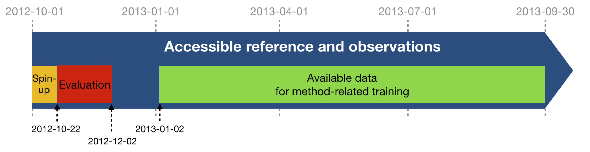

[](https://doi.org/10.5281/zenodo.4045400)

# SSH Mapping Data Challenge 2020a

This repository contains codes and sample notebooks for downloading and processing the SSH mapping data challenge.

The quickstart can be run online by clicking here:
[![Binder](https://img.shields.io/badge/launch-binder-579aca.svg?logo=data:image/png;base64,iVBORw0KGgoAAAANSUhEUgAAAFkAAABZCAMAAABi1XidAAAB8lBMVEX///9XmsrmZYH1olJXmsr1olJXmsrmZYH1olJXmsr1olJXmsrmZYH1olL1olJXmsr1olJXmsrmZYH1olL1olJXmsrmZYH1olJXmsr1olL1olJXmsrmZYH1olL1olJXmsrmZYH1olL1olL0nFf1olJXmsrmZYH1olJXmsq8dZb1olJXmsrmZYH1olJXmspXmspXmsr1olL1olJXmsrmZYH1olJXmsr1olL1olJXmsrmZYH1olL1olLeaIVXmsrmZYH1olL1olL1olJXmsrmZYH1olLna31Xmsr1olJXmsr1olJXmsrmZYH1olLqoVr1olJXmsr1olJXmsrmZYH1olL1olKkfaPobXvviGabgadXmsqThKuofKHmZ4Dobnr1olJXmsr1olJXmspXmsr1olJXmsrfZ4TuhWn1olL1olJXmsqBi7X1olJXmspZmslbmMhbmsdemsVfl8ZgmsNim8Jpk8F0m7R4m7F5nLB6jbh7jbiDirOEibOGnKaMhq+PnaCVg6qWg6qegKaff6WhnpKofKGtnomxeZy3noG6dZi+n3vCcpPDcpPGn3bLb4/Mb47UbIrVa4rYoGjdaIbeaIXhoWHmZYHobXvpcHjqdHXreHLroVrsfG/uhGnuh2bwj2Hxk17yl1vzmljzm1j0nlX1olL3AJXWAAAAbXRSTlMAEBAQHx8gICAuLjAwMDw9PUBAQEpQUFBXV1hgYGBkcHBwcXl8gICAgoiIkJCQlJicnJ2goKCmqK+wsLC4usDAwMjP0NDQ1NbW3Nzg4ODi5+3v8PDw8/T09PX29vb39/f5+fr7+/z8/Pz9/v7+zczCxgAABC5JREFUeAHN1ul3k0UUBvCb1CTVpmpaitAGSLSpSuKCLWpbTKNJFGlcSMAFF63iUmRccNG6gLbuxkXU66JAUef/9LSpmXnyLr3T5AO/rzl5zj137p136BISy44fKJXuGN/d19PUfYeO67Znqtf2KH33Id1psXoFdW30sPZ1sMvs2D060AHqws4FHeJojLZqnw53cmfvg+XR8mC0OEjuxrXEkX5ydeVJLVIlV0e10PXk5k7dYeHu7Cj1j+49uKg7uLU61tGLw1lq27ugQYlclHC4bgv7VQ+TAyj5Zc/UjsPvs1sd5cWryWObtvWT2EPa4rtnWW3JkpjggEpbOsPr7F7EyNewtpBIslA7p43HCsnwooXTEc3UmPmCNn5lrqTJxy6nRmcavGZVt/3Da2pD5NHvsOHJCrdc1G2r3DITpU7yic7w/7Rxnjc0kt5GC4djiv2Sz3Fb2iEZg41/ddsFDoyuYrIkmFehz0HR2thPgQqMyQYb2OtB0WxsZ3BeG3+wpRb1vzl2UYBog8FfGhttFKjtAclnZYrRo9ryG9uG/FZQU4AEg8ZE9LjGMzTmqKXPLnlWVnIlQQTvxJf8ip7VgjZjyVPrjw1te5otM7RmP7xm+sK2Gv9I8Gi++BRbEkR9EBw8zRUcKxwp73xkaLiqQb+kGduJTNHG72zcW9LoJgqQxpP3/Tj//c3yB0tqzaml05/+orHLksVO+95kX7/7qgJvnjlrfr2Ggsyx0eoy9uPzN5SPd86aXggOsEKW2Prz7du3VID3/tzs/sSRs2w7ovVHKtjrX2pd7ZMlTxAYfBAL9jiDwfLkq55Tm7ifhMlTGPyCAs7RFRhn47JnlcB9RM5T97ASuZXIcVNuUDIndpDbdsfrqsOppeXl5Y+XVKdjFCTh+zGaVuj0d9zy05PPK3QzBamxdwtTCrzyg/2Rvf2EstUjordGwa/kx9mSJLr8mLLtCW8HHGJc2R5hS219IiF6PnTusOqcMl57gm0Z8kanKMAQg0qSyuZfn7zItsbGyO9QlnxY0eCuD1XL2ys/MsrQhltE7Ug0uFOzufJFE2PxBo/YAx8XPPdDwWN0MrDRYIZF0mSMKCNHgaIVFoBbNoLJ7tEQDKxGF0kcLQimojCZopv0OkNOyWCCg9XMVAi7ARJzQdM2QUh0gmBozjc3Skg6dSBRqDGYSUOu66Zg+I2fNZs/M3/f/Grl/XnyF1Gw3VKCez0PN5IUfFLqvgUN4C0qNqYs5YhPL+aVZYDE4IpUk57oSFnJm4FyCqqOE0jhY2SMyLFoo56zyo6becOS5UVDdj7Vih0zp+tcMhwRpBeLyqtIjlJKAIZSbI8SGSF3k0pA3mR5tHuwPFoa7N7reoq2bqCsAk1HqCu5uvI1n6JuRXI+S1Mco54YmYTwcn6Aeic+kssXi8XpXC4V3t7/ADuTNKaQJdScAAAAAElFTkSuQmCC)](https://binder.pangeo.io/v2/gh/ocean-data-challenges/2020a_SSH_mapping_NATL60/master?filepath=quickstart.ipynb)

## Motivation

The goal is to investigate how to best reconstruct sequences of Sea Surface Height (SSH) maps from partial satellite altimetry observations. This data challenge follows an _Observation System Simulation Experiment_ framework: "Real" full SSH are from a numerical simulation with a realistic, high-resolution ocean circulation model: the reference simulation. Satellite observations are simulated by sampling the reference simulation based on realistic orbits of past, existing or future altimetry satellites. A baseline reconstruction method is provided (see below) and the practical goal of the challenge is to beat this baseline according to scores also described below and in Jupyter notebooks.

### Reference simulation
The reference simulation is the NATL60 simulation based on the NEMO model (Ajayi et al. 2020 doi:[10.1029/2019JC015827](https://doi.org/10.1029/2019JC015827)). The simulation is run without tidal forcing. 

### Observations
The SSH observations include simulations of Topex-Poseidon, Jason 1, Geosat Follow-On, Envisat, and SWOT altimeter data. This nadir altimeters constellation was operating during the 2003-2005 period and is still considered as a historical optimal constellation in terms of spatio-temporal coverage. The data challenge simulates the addition of SWOT to this reference constellation. No observation error is considered in this challenge.

### Data sequence and use
 
The SSH reconstructions are assessed over the period from 2012-10-22 to 2012-12-02: 42 days, which is equivalent to two SWOT cycles in the SWOT science phase orbit.
For reconstruction methods that need a spin-up, the **observations** can be used from 2012-10-01 until the beginning of the evaluation period (21 days). This spin-up period is not included in the evaluation. For reconstruction methods that need learning from full fields, the **reference data** can be used from 2013-01-02 to 2013-09-30. The reference data between 2012-12-02 and 2013-01-02 should never be used so that any learning period or other method-related-training period can be considered uncorrelated to the evaluation period.



## Leaderboard

| Method     |   µ(RMSE) |   σ(RMSE) |   λx (degree) |   λt (days) | Notes                     | Reference        |
|:-----------|------------------------:|---------------------:|-------------------------:|-----------------------:|:--------------------------|:-----------------|
| baseline OI 1 nadir |                    0.69 |                 0.03 |                     3.31 |                  33.32 | Covariances not optimized | [quickstart.ipynb](https://github.com/ocean-data-challenges/2020a_SSH_mapping_NATL60/blob/master/quickstart.ipynb)  |
| baseline OI 4 nadirs |                    0.83 |                 0.04 |                     2.25 |                  15.67 | Covariances not optimized | [quickstart.ipynb](https://github.com/ocean-data-challenges/2020a_SSH_mapping_NATL60/blob/master/quickstart.ipynb) |
| baseline OI 1 swot |                    0.85 |                 0.05 |                     1.22 |                  12.38 | Covariances not optimized | [quickstart.ipynb](https://github.com/ocean-data-challenges/2020a_SSH_mapping_NATL60/blob/master/quickstart.ipynb) |
| | | | | | | |
| duacs 4 nadirs |       0.92 |     <span style="color:green"> **0.01** </span> |          1.42 |       12.13 | Covariances DUACS | [eval_duacs.ipynb](https://github.com/ocean-data-challenges/2020a_SSH_mapping_NATL60/blob/master/notebooks/eval_duacs.ipynb)  |
| bfn 4 nadirs  |       0.92 |      0.02 |          1.23 |       10.82 | QG Nudging | [eval_bfn.ipynb](https://github.com/ocean-data-challenges/2020a_SSH_mapping_NATL60/blob/master/notebooks/eval_bfn.ipynb) |
| dymost 4 nadirs |       0.91 |     <span style="color:green"> **0.01** </span> |          1.36 |       11.91 | Dynamic mapping | [eval_dymost.ipynb](https://github.com/ocean-data-challenges/2020a_SSH_mapping_NATL60/blob/master/notebooks/eval_dymost.ipynb) |
| miost 4 nadirs |       0.93 |     <span style="color:green"> **0.01** </span> |          1.35 |       10.41 | Multiscale mapping | [eval_miost.ipynb](https://github.com/ocean-data-challenges/2020a_SSH_mapping_NATL60/blob/master/notebooks/eval_miost.ipynb) |
| 4DVarNet 4 nadirs |      <span style="color:green"> **0.94** |     <span style="color:green">**0.01** </span> |          1.19 |       10.64 | 4DVarNet mapping | [eval_4dvarnet.ipynb](https://github.com/ocean-data-challenges/2020a_SSH_mapping_NATL60/blob/master/notebooks/eval_4dvarnet.ipynb) |
| 4DVarNet v2022 4 nadirs :trophy: |       <span style="color:green">**0.94** </span> |      <span style="color:green">**0.01** </span> |         <span style="color:green"> **0.83** |      <span style="color:green"> **8.03** | 4DVarNet mapping | [eval_4dvarnet_v2022.ipynb](https://github.com/ocean-data-challenges/2020a_SSH_mapping_NATL60/blob/master/notebooks/eval_4dvarnet_v2022.ipynb) |
| | | | | | | |
| duacs 1 swot + 4 nadirs |       0.92 |      0.02 |          1.22 |       11.37 | Covariances DUACS |[eval_duacs.ipynb](https://github.com/ocean-data-challenges/2020a_SSH_mapping_NATL60/blob/master/notebooks/eval_duacs.ipynb) |
| bfn 1 swot + 4 nadirs  |       0.93 |      0.02 |           1. |        10.24 | QG Nudging | [eval_bfn.ipynb](https://github.com/ocean-data-challenges/2020a_SSH_mapping_NATL60/blob/master/notebooks/eval_bfn.ipynb) |
| dymost 1 swot + 4 nadirs |       0.93 |      0.02 |           1.19 |        10.04 | Dynamic mapping | [eval_dymost.ipynb](https://github.com/ocean-data-challenges/2020a_SSH_mapping_NATL60/blob/master/notebooks/eval_dymost.ipynb) |
| miost 1 swot + 4 nadirs |       0.94 |      <span style="color:green">**0.01** </span> |          1.18 |       10.33 | Multiscale mapping | [eval_miost.ipynb](https://github.com/ocean-data-challenges/2020a_SSH_mapping_NATL60/blob/master/notebooks/eval_miost.ipynb) |
| 4DVarNet 1 swot + 4 nadirs |       0.95 |      <span style="color:green">**0.01** </span> |          0.7 |        6.48 | 4DVarNet mapping | [eval_4dvarnet.ipynb](https://github.com/ocean-data-challenges/2020a_SSH_mapping_NATL60/blob/master/notebooks/eval_4dvarnet.ipynb) |
| 4DVarNet v2022 1 swot + 4 nadirs :trophy: |       <span style="color:green">**0.96** </span> |     <span style="color:green"> **0.01** </span> |          <span style="color:green">**0.62** </span> |        <span style="color:green">**4.35** </span> | 4DVarNet mapping | [eval_4dvarnet_v2022.ipynb](https://github.com/ocean-data-challenges/2020a_SSH_mapping_NATL60/blob/master/notebooks/eval_4dvarnet_v2022.ipynb) |


**µ(RMSE)**: average RMSE score.  
**σ(RMSE)**: standard deviation of the RMSE score.  
**λx**: minimum spatial scale resolved.  
**λt**: minimum time scale resolved. 
 
## Quick start
You can follow the quickstart guide in [this notebook](https://github.com/ocean-data-challenges/2020a_SSH_mapping_NATL60/blob/master/quickstart.ipynb) or launch it directly from <a href="https://binder.pangeo.io/v2/gh/ocean-data-challenges/2020a_SSH_mapping_NATL60/master?filepath=quickstart.ipynb" target="_blank">binder</a>.

## Download the data
The data are hosted on the [AVISO+ website](https://www.aviso.altimetry.fr/en/data/products/ocean-data-challenges/2020a-ssh-mapping-natl60.html) and tagged with DOI: 10.24400/527896/a01-2020.002. The website also provides a data handbook. This is the recommended access. This [wiki](https://github.com/ocean-data-challenges/2020a_SSH_mapping_NATL60/wiki/AVISO---account-creation) can help you create an AVISO account to access the data. The data are also temporarily available [here](https://ige-meom-opendap.univ-grenoble-alpes.fr/thredds/catalog/meomopendap/extract/ocean-data-challenges/dc_data1/catalog.html). They are presented with the following directory structure:

```
. 
|-- dc_obs
|   |-- 2020a_SSH_mapping_NATL60_topex-poseidon_interleaved.nc
|   |-- 2020a_SSH_mapping_NATL60_nadir_swot.nc 
|   |-- 2020a_SSH_mapping_NATL60_karin_swot.nc
|   |-- 2020a_SSH_mapping_NATL60_jason1.nc
|   |-- 2020a_SSH_mapping_NATL60_geosat2.nc
|   |-- 2020a_SSH_mapping_NATL60_envisat.nc

|-- dc_ref
|   |-- NATL60-CJM165_GULFSTREAM_y****m**d**.1h_SSH.nc

```

To start out download the *observation* dataset (dc_obs, 285M) from the temporary data server, use: 
```shell
wget https://ige-meom-opendap.univ-grenoble-alpes.fr/thredds/fileServer/meomopendap/extract/ocean-data-challenges/dc_data1/dc_obs.tar.gz
```

and the *reference* dataset (dc_ref, 11G) using (*this step may take several minutes*): 

```shell
wget https://ige-meom-opendap.univ-grenoble-alpes.fr/thredds/fileServer/meomopendap/extract/ocean-data-challenges/dc_data1/dc_ref.tar.gz
```
and then uncompress the files using `tar -xvf <file>.tar.gz`. You may also use `ftp`, `rsync` or `curl`to donwload the data.  


## Baseline and evaluation

### Baseline
The baseline mapping method is optimal interpolation (OI), in the spirit of the present-day standard for DUACS products provided by AVISO. OI is implemented in the [`baseline_oi`](https://github.com/ocean-data-challenges/2020a_SSH_mapping_NATL60/blob/master/notebooks/baseline_oi.ipynb) Jupyter notebook. The SSH reconstructions are saved as a NetCDF file in the `results` directory. The content of this directory is git-ignored.
   
### Evaluation

The evaluation of the mapping methods is based on the comparison of the SSH reconstructions with the *reference* dataset. It includes two scores, one based on the Root-Mean-Square Error (RMSE), the other based on Fourier wavenumber spectra. The evaluation notebook [`example_data_eval`](https://github.com/ocean-data-challenges/2020a_SSH_mapping_NATL60/blob/master/notebooks/example_data_eval.ipynb) implements the computation of these two scores as they could appear in the leaderboard. The notebook also provides additional, graphical diagnostics based on RMSE and spectra.

## Data processing

Cross-functional modules are gathered in the `src` directory. They include tools for regridding, plots, evaluation, writing and reading NetCDF files. The directory also contains a module that implements the baseline method.  

## Acknowledgement

The structure of this data challenge was to a large extent inspired by [WeatherBench](https://github.com/pangeo-data/WeatherBench).
